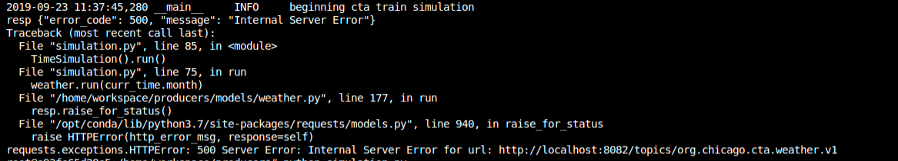

## Project WriteUp

Hi Reviewer,

It's been quite a challenge on this project. Interesting though. I have implemented all the todos found in the starter code and below I will point out some of the areas which I will like you to check out and give suggestions for improvement.

To begin, the producer for weather data throws a `500` Internal Server Error when I configure it with the following snippet.




```
 resp = requests.post(

            f"{Weather.rest_proxy_url}/topics/{self.topic_name}",

            headers={"Content-Type": "application/vnd.kafka.avro.v2+json", "Accept": "application/vnd.kafka.v2+json"},
            data=json.dumps(
                {   
                    "key_schema":  Weather.key_schema,
                    "value_schema": Weather.value_schema,
                    "records": [{ 
                        "key": {"timestamp": 1545730073},
                        "value": {"temperature": self.temp, "status": self.status.name}
                    }]
                }
            ),
         )
```

So I ended up with 

```
resp = requests.post(

           f"{Weather.rest_proxy_url}/topics/{self.topic_name}",

           headers={"Content-Type": "application/vnd.kafka.json.v2+json"},
           data=json.dumps(
               {
                   "records": [
                        {"value": { "temperature": self.temp, "status": self.status.name } }
                    ]
               }
           ),
        )
```

You may want to check it out and give some tips if it's that I'm not doign it rightly. I will appreciate.
With my current implementation, I am able to see the produced messages with the `kafka-consumer-console` but the consumer webpage template does not update as the messages are received from the consumer.

> I would like you to note that the workspace provided(recommended for implementing the project) does not have a webbrowser to test put the final webpage and how it is updating continously. So I was using a command line browser, `w3m` to checkout my results. So I don't know if that maybe why I couldn't get live updates from the browser.


At the level of the consumers, I noticed that  in the `lines.py` file, the checks that where done to handle incoming messages didn't handle the case for `arrivals` because the messages line record for is an `int` ranging between `0`, `1`, `2`  representing the different colors but when handling the messages coming in to the producers. Below is the snippet that handles inncoming mseeages in the `Lines.py` 

```
def process_message(self, message):

    if "org.chicago.cta.station" in message.topic():

        value = message.value()

        if message.topic() == "org.chicago.cta.stations.table.v1":
            value = json.loads( message.value() )
        if value["line"] == "green":
            self.green_line.process_message(message)
        elif value["line"] == "red":
            self.red_line.process_message(message)
        elif value["line"] == "blue":
            self.blue_line.process_message(message)
        else:
            logger.debug("discarding unknown line msg %s", value["line"])
    elif "TURNSTILE_SUMMARY" == message.topic():
        self.green_line.process_message(message)
        self.red_line.process_message(message)
        self.blue_line.process_message(message)
    else:
        logger.info("ignoring non-lines message %s", message.topic())
```

So I modified it to something like

```
    def process_message(self, message):
        
        """Processes a station message"""
        if "org.chicago.cta.station" in message.topic():
            value = message.value()
            if message.topic() == "org.chicago.cta.stations.table.v1":
                value = json.loads( message.value() )
                print("value", value)
            if value["line"] == "green" or value["line"] == 1:
                self.green_line.process_message(message)
            elif value["line"] == "red" or value["line"] == 2:
                self.red_line.process_message(message)
            elif value["line"] == "blue" or value["line"] == 0:
                self.blue_line.process_message(message)
            else:
                logger.debug("discarding unknown line msg %s", value["line"])
        elif "TURNSTILE_SUMMARY" == message.topic():
            self.green_line.process_message(message)
            self.red_line.process_message(message)
            self.blue_line.process_message(message)
        else:
            logger.info("ignoring non-lines message %s", message.topic())
```

If you think something is lacking in my implementation then I would be glad if you gave me some tips. Otherwise, Thank you very much for the project. It's really challenging and knowledgeable. 


